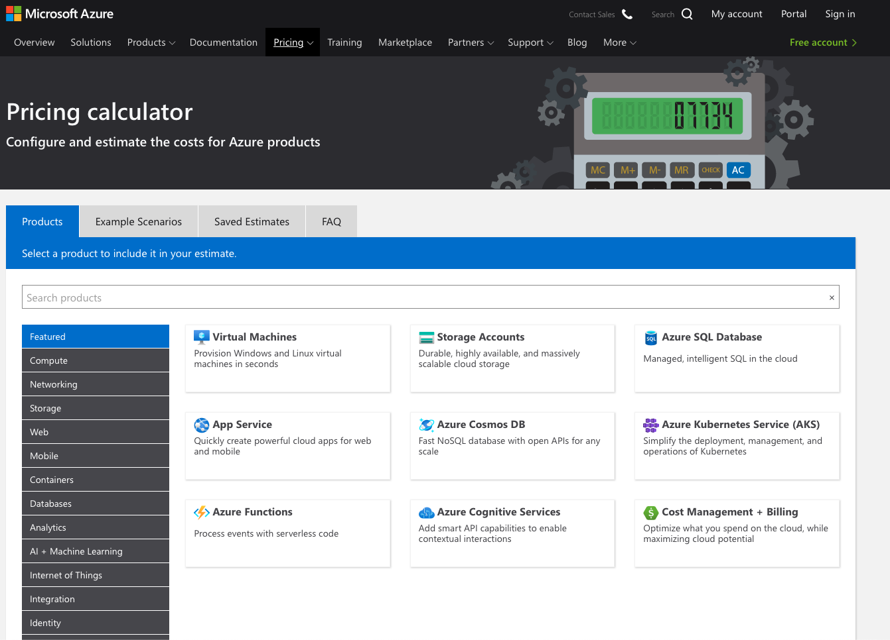
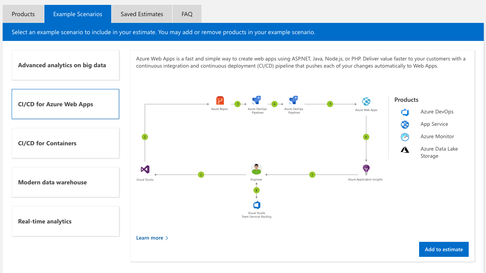
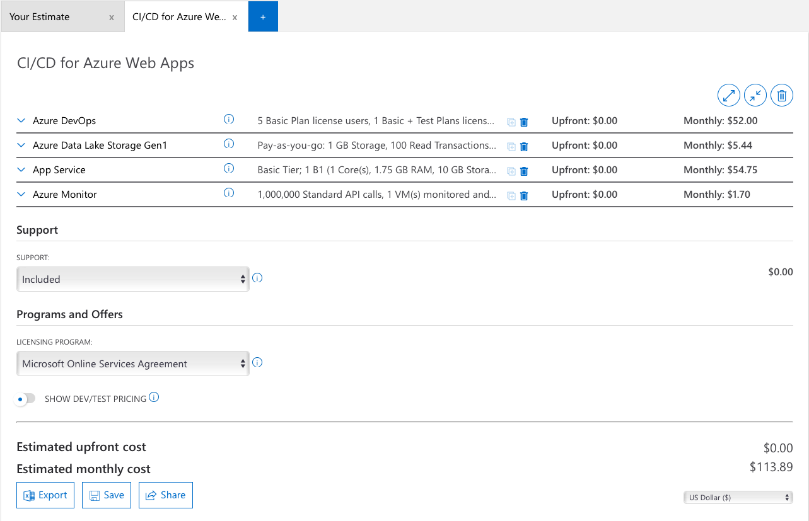

**Add a cover photo like:**

# Azure Costs and pricing models

## Introduction

Cost is one of the most important aspects of the cloud and can have a massive impact on your business. Azure has several tools available to help you get a better understanding of cloud spend and some best practices that you can leverage to help you save money.

## Usage meters

* Compute Hours
* IP Address Hours
* Data Transfer In
* Data Transfer Out
* Standard Managed Disk
* Standard Managed Disk Operations
* Standard IO-Disk
* Standard IO-Block Blob Read
* Standard IO-Block Blob Write
* Standard IO-Block Blob Delete

## Factors affecting costs

* Resource type
* Services
* Location
* Azure billing zones

## Azure pricing calculator

To make estimates easy for customers to create, Microsoft developed the Azure pricing calculator. The Azure pricing calculator is a free web-based tool that allows you to input Azure services and modify properties and options of the services. It outputs the costs per service and total cost for the full estimate.

On the pricing calculator page, you'll see several tabs:

* Products. This tab is where you'll do most of your activity. This tab has all the Azure services listed and is where you'll add or remove services to put together your estimate.
* Example Scenarios This tab has several examples of infrastructure involved in common cloud-based solutions. You can add all the components of the entire scenario to estimate the cost.
* Saved Estimates. This tab has all of your previously saved estimates. We'll go through this process in a moment.
* FAQ. Just as it says, this tab has answers to some frequently asked questions.

## Tried out example scenarios on Azure pricing calculator

I've tried out example Scenarios of CI/CD for Azure Web Apps
Which uses following Azure Products:
* Azure DevOps
* App Service
* Azure Monitor
* Azure Data Lake Storage

### Step 1 — Open Pricing Calculator 

[Azure Pricing Calculator ](https://azure.microsoft.com/en-us/pricing/calculator/)

### Step 2 — Click 2nd tab "Example Scenarios" and "CI/CD for Azure Web Apps"

### Step 3 — Check and modify your estimate.

## ☁️ Finally you can export, save and share this estimate with your boss! 

Also you can directly purchase the estimated cost.

## Results

We have arrived at a cost estimate for a set of Azure services without spending any money. We didn't create anything, and we have a fully sharable estimate that we can do further analysis or modifications on in the future

## Social Proof

✍️ Show that you shared your process on Twitter or LinkedIn

[DEV.tp](https://dev.to/sudhachandranbc/microsoft-azure-pricing-calculator-2628)
[Twitter](https://twitter.com/SudhaKishoreBC/status/1290250743581040640)
